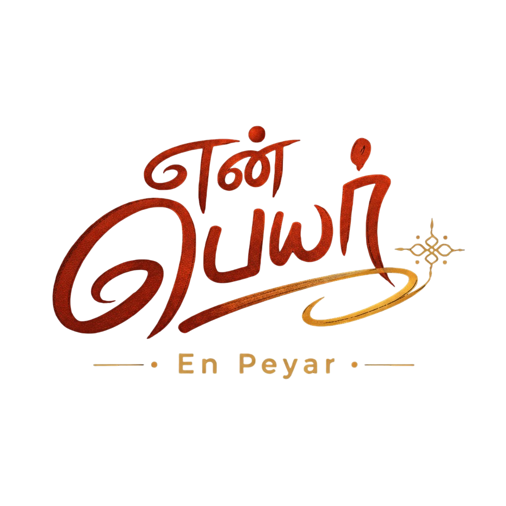

<div align="center">
  
  <h1>En Peyar</h1>
  <p><strong>Ancient words. New ideas.</strong></p>
  <p>The world's only AI naming engine rooted in 2000+ years of Tamil literature.</p>
  
  <p>
    <a href="https://github.com/MKishoreDev/en-peyar">
      
    </a>
    <a href="https://github.com/MKishoreDev/en-peyar/blob/main/LICENSE">
      
    </a>
    
    
  </p>

  **[Live Demo](#) • [Documentation](#features) • [Contributing](#contributing)**
</div>

---

## What Is En Peyar?

En Peyar (என் பெயர் — "My Name" in Tamil) is an open-source AI naming engine that generates brand names, project names, and business names rooted in Tamil language, culture, and literary tradition.

Unlike generic AI naming tools that produce random syllables, En Peyar understands:

- **Cultural Context** — Names drawn from 2,000 years of Tamil literature, Sangam poetry, and historical texts
- **Semantic Meaning** — Every name carries real meaning connected to your brand/project purpose
- **Linguistic Authenticity** — Real Tamil words, place names, and historical roots — not invented combinations
- **Context Awareness** — Suggestions relate directly to what you're building, not random outputs

**Example:**
- Input: *"AI assistant that helps users make decisions"*
- Output: **Sindhanai** (சிந்தனை) — "The act of thinking itself" — Sangam-era word
- Why: Perfectly captures the function (AI that thinks) without being literal

---

## Features

### 🎯 Intelligent Name Generation
- **Two-stage pipeline:** Strategy extraction → Context-aware naming
- **Four naming modes:**
  - **Tamil** — Pure classical Tamil words only
  - **English** — Pure English names inspired by extracted concepts
  - **Tanglish** — Tamil roots + modern suffixes (Arivo, Thedalo, Meivo)
  - **Mixed** — Distribution of all three styles
- **Context filtering** — Names must relate directly to your input
- **Scoring system** — Memorability, pronounceability, brandability, originality

### 🏛️ Tamil Knowledge Engine
- **Sangam Era vocabulary** (300 BCE – 300 CE) — earliest Tamil literature
- **Post-Sangam & Classical Tamil** — medieval period roots
- **Thirukkural concepts** — 1,330 compressed wisdom verses
- **Historical place names** — Koodal, Porunai, Sethu, etc.
- **River, mountain, flora/fauna names** — Natural geography inspiration
- **Virtue & emotion words** — Psychological depth

### 🎨 Logo Prompt Generator
Designer-grade logo briefs for each name, ready for Midjourney, DALL-E, or human designers:
- Visual direction & mood
- Typography guidance
- Colour system with palette
- Brand rationale
- Usage examples

### 🗺️ Tamil Nadu District Explorer
Interactive SVG map of all 32 districts:
- Historical context & cultural significance
- Local naming inspiration
- Brand mood per region
- Industry focus areas

### 📖 Classical Tamil Roots Thesaurus
Categorised collection of high-quality Tamil words with:
- Meaning in English
- Literary source (Sangam, Thirukkural, etc.)
- Pronunciation guide
- Related concepts
- Click to load into generator

### 🔤 Thirukkural Widget
Live classical verse from the **[Kural API](https://thirukural-api.onrender.com/)**:
- Random Tamil verse with English translation
- Full couplet in Tamil script
- Philosophical explanation
- Inspiration for naming

### 🔊 Pronunciation & TTS
- Tamil script rendering with Noto Sans Tamil
- Syllable-by-syllable pronunciation guides
- Native Tamil speaker audio (gTTS)
- Clear ISO transcription

### 🌍 Multi-language UI
- **Tamil (தமிழ்)** — Full native interface (252 keys)
- **English** — Complete parallel interface
- **Dark/Light mode** — System-aware with warm Tamil colour palette
- **Mobile optimized** — Bottom navigation, touch-friendly

### ⭐ Shortlist & Favourites
- Save names during session
- Export as JSON/CSV
- Share lists
- Browser storage

### 🎓 Educational
- Learn Tamil naming principles
- Understand literary sources
- Explore cultural context
- Build naming literacy

---

## Stack

| Component | Technology |
|-----------|-------------|
| **Backend** | Python 3 + Flask |
| **AI/LLM** | Groq (Llama-3.3-70B) |
| **Frontend** | Vanilla JS + Tailwind CSS (no build step) |
| **Styling** | Custom design system with Tamil-inspired colours |
| **Database** | Static JSON (no persistence layer) |
| **Hosting** | Deployable anywhere (Flask + static files) |
| **API** | RESTful (no auth required) |

---

## Installation & Setup

### Requirements
- Python 3.10+
- Groq API key (free tier available)

### Quick Start

```bash
git clone https://github.com/MKishoreDev/en-peyar
cd en-peyar

# Install dependencies
pip install -r requirements.txt

# Create .env file
cp .env.example .env
# Add your GROQ_API_KEY to .env

# Run the development server
python app.py
```

Open `http://localhost:5000`

### Without API Key
The app works for all non-generation features:
- Tamil Nadu map explorer
- Classical roots thesaurus
- Thirukkural widget
- District information
- About & philosophy pages

Generation requires `GROQ_API_KEY`.

---

## How The Naming Engine Works

### Stage 1 — Strategy Extraction
Input:
```
Keywords: "Food delivery app"
Context: "Help users discover neighborhood restaurants"
Industry: "Food & Hospitality"
```

AI extracts:
```json
{
  "function": "Connects users to nearby restaurants",
  "benefit": "Discovery + convenience",
  "emotion": "Appetite, anticipation, exploration",
  "concepts": ["discovery", "movement", "flavour", "gathering", "local"],
  "directions": [
    "Sangam words for food, movement, gathering",
    "Classical Tamil emotion words",
    "River/place names suggesting flow"
  ]
}
```

### Stage 2 — Context-Aware Name Generation
Instead of generating random combinations, the AI:

1. **Maps your concepts** to real Tamil literary sources
2. **Searches its knowledge** of Sangam, Thirukkural, and classical Tamil
3. **Filters for relevance** — names must relate to your context
4. **Scores candidates** on meaningful criteria
5. **Returns only names with clear cultural/linguistic explanation**

### Stage 3 — Enriched Output
Each name returns with:
- **Tamil script** + romanisation
- **Meaning** + literary source
- **Pronunciation** (syllable by syllable)
- **Why it matches your context** (required explanation)
- **Brand score** (memorability, pronounceability, etc.)
- **5-word tagline**
- **Logo design prompt**

---

## Naming Modes Explained

### Tamil Mode
**Pure classical Tamil words only**

```
Input: "AI assistant"
Output:
  Sindhanai (சிந்தனை) — "The act of thinking itself"
  Arivu (அறிவு) — "Knowledge, intellect"
  Mathi (மதி) — "Wit, judgement, intellect"
```

✓ Real words from Sangam/Thirukkural  
✓ Pronounced by Tamil speakers for thousands of years  
✓ No English component

### English Mode
**Pure English names inspired by extracted meaning**

```
Input: "AI assistant"
Output:
  Thoughtcraft
  MindPath
  JudgmentCore
```

✓ English words entirely  
✓ Inspired by Tamil semantic concepts  
✓ No Tamil elements

### Tanglish Mode
**Tamil root + modern suffix = one new word**

```
Input: "AI assistant"
Output:
  Arivio (Arivu + -io suffix)
  Sindhanax (Sindhanai + -ax suffix)
  Mathino (Mathi + -no suffix)
```

✓ Sounds modern + feels Tamil  
✓ Single unified word  
✓ Globally pronounceable  
✓ Perfect for startups wanting cultural-modern blend

### Mixed Mode
**Distribution of all three**

```
Output: [Tamil], [Tanglish], [English], [Tamil], [Tanglish], [English], [Tamil], [Tanglish], [English], [Tamil]
```

✓ See all options  
✓ Find your vibe  
✓ Compare styles

---

## API Reference

### POST `/api/generate`

Generate brand names.

**Request:**
```json
{
  "keywords": "food delivery app",
  "context": "Help users discover neighborhood restaurants",
  "industry": "Food & Hospitality",
  "style": "Tamil"
}
```

**Response:**
```json
{
  "names": [
    {
      "name": "Sindhanai",
      "meaning": "The act of thinking itself — perfect for AI that helps users decide.",
      "pronunciation": "sin-tha-nai",
      "tamilRoot": "சிந்தனை (Sindhanai) — Sangam-era verb noun",
      "suggestedIndustry": "Food & Hospitality",
      "tagline": "Thinking through every choice.",
      "contextRelevance": "Food discovery requires decision-making — Sindhanai captures that thinking process."
    }
  ]
}
```

### POST `/api/refine`

Refine context descriptions & get keyword suggestions.

**Request:**
```json
{
  "keywords": "food",
  "context": "delivery app for restaurants",
  "industry": "Food & Hospitality"
}
```

**Response:**
```json
{
  "refined": "A mobile app that connects users to nearby restaurants, enabling discovery and ordering of local cuisine.",
  "keywords": ["discovery", "local", "food", "community", "gathering"]
}
```

### GET `/api/tts?text=Sindhanai&lang=ta`

Text-to-speech for names (Tamil or English).

---

## External APIs & Data Sources

| Service | Purpose | Link |
|---------|---------|------|
| **Groq API** | Name generation LLM | https://console.groq.com |
| **Thirukkural API** | Live Tamil verses | https://thirukural-api.onrender.com |
| **gTTS** | Tamil/English pronunciation | https://gtts.readthedocs.io |

---

## Languages & Localization

✓ **Tamil (தமிழ்)** — Full native interface  
✓ **English** — Complete parallel  
✓ **252 translation keys** — All UI elements  
✓ **Easy to add:** Contribute translations via GitHub

---

## Project Structure

```
en-peyar/
├── app.py                       # Flask backend, AI pipeline
├── requirements.txt
├── .env.example
├── README.md
├── CONTRIBUTING.md
├── static/
│   ├── css/style.css            # Design system (451 lines)
│   ├── js/main.js               # Frontend logic (1,760 lines)
│   ├── data/
│   │   └── districts.json       # 32 Tamil Nadu districts
│   ├── locales/
│   │   ├── en.json              # 252 English keys
│   │   └── ta.json              # 252 Tamil keys
│   └── images/
│       ├── logo.png
│       └── tamilnadu_map.svg    # Interactive district map
└── templates/
    ├── index.html               # Standalone (no Jinja)
    └── about.html               # Philosophy & open source
```

---

## Technical Details

### Model Selection
**Primary:** `llama-3.3-70b-versatile` (Groq)
- Best Tamil semantic understanding
- Excellent cultural context awareness
- Free tier available

**Why not smaller models:** 8B models hallucinate random names like "Onguva". The 70B model understands Tamil literature deeply.

### Prompt Engineering
The prompt contains:
- **Examples of excellence** — Arattai, Aruvi, Thelivu, Koodal, Thedal
- **Cultural reasoning** — Why each name works
- **Hard constraints** — Context relevance required
- **Scoring rubric** — Memorability, pronounceability, originality
- **Rejection rules** — What NOT to generate

### Context Filtering
Every generated name must:
- ✓ Have clear meaning
- ✓ Relate to user's input
- ✓ Be pronounceable
- ✓ Have cultural/literary explanation
- ✗ Not be random syllables
- ✗ Not be context-unrelated

---

## Contributing

We welcome contributions! See [CONTRIBUTING.md](CONTRIBUTING.md) for:

- Adding Tamil roots
- Improving translations
- Enhancing UI/UX
- Submitting name suggestions
- Bug reports

### To Contribute
1. Fork the repo
2. Create a feature branch
3. Make your changes
4. Test locally
5. Submit a PR with description

---

## License

MIT License — Use freely, modify, redistribute.

See [LICENSE](LICENSE) for full terms.

---

## Design Philosophy

En Peyar is built on a single conviction:

> *Tamil gave the world a complete system for understanding human experience 2,000 years before modern branding existed. En Peyar simply connects that system to people building the next thousand companies, projects, and brands.*

**Not for:** Random name suggestions  
**For:** Meaningful names with cultural depth and global appeal

---

## Roadmap

- [ ] Community-driven root suggestions
- [ ] Era selector (Sangam, Chola, Classical, Modern)
- [ ] Domain availability integration (all TLDs)
- [ ] Mobile app (iOS/Android)
- [ ] Trademark conflict checker
- [ ] Competitor name analysis
- [ ] AI logo generation (not just prompts)
- [ ] Name etymology deep dive (interactive timeline)
- [ ] Global naming conferences (virtual community events)

---

## Support

- **GitHub Issues** — Bug reports & feature requests
- **Discussions** — Community Q&A
- **Email** — Contact via GitHub profile

---

<div align="center">

**Built with ❤️ for Tamil founders, creators, and makers worldwide**

*தமிழ் வாழ்க — Tamil shall live*

[⬆ back to top](#)

</div>
READMEEOF
echo "README.md created: $(wc -l < /home/claude/yen-peyar/README.md) lines"
