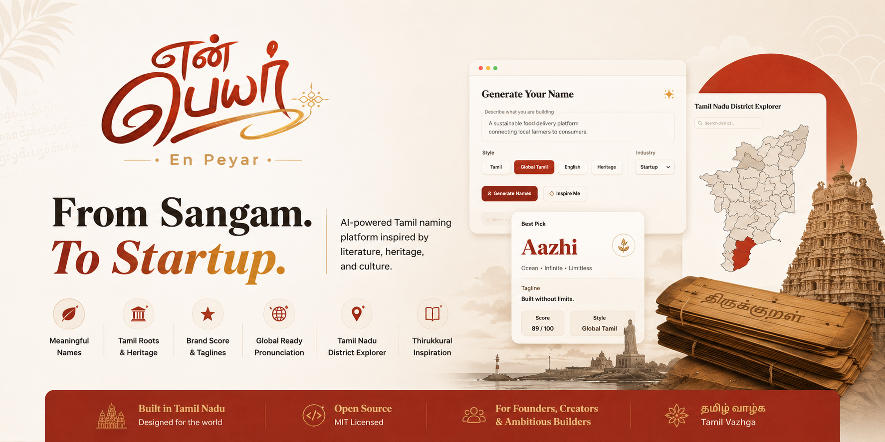
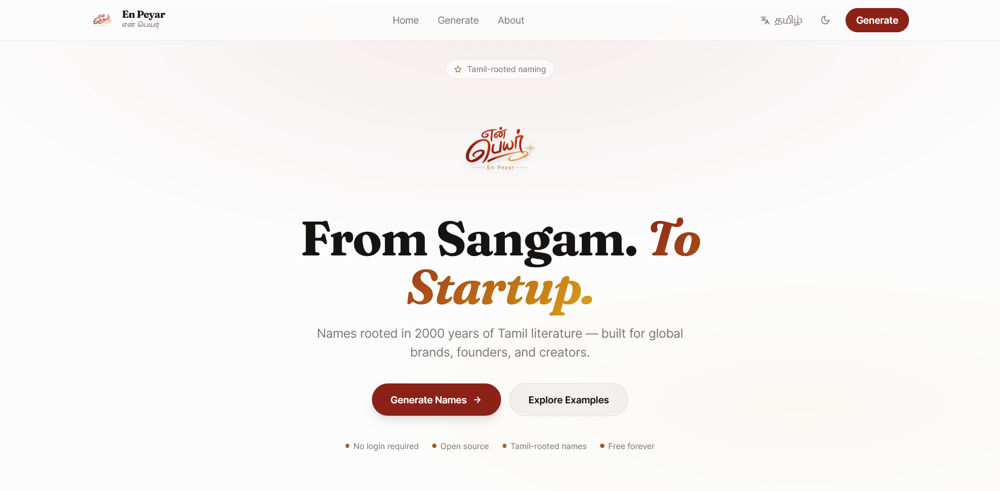
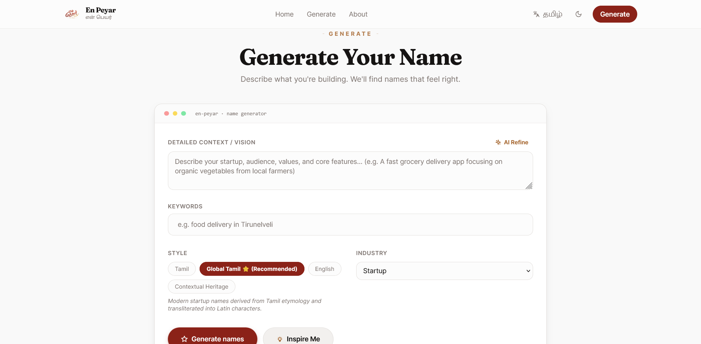
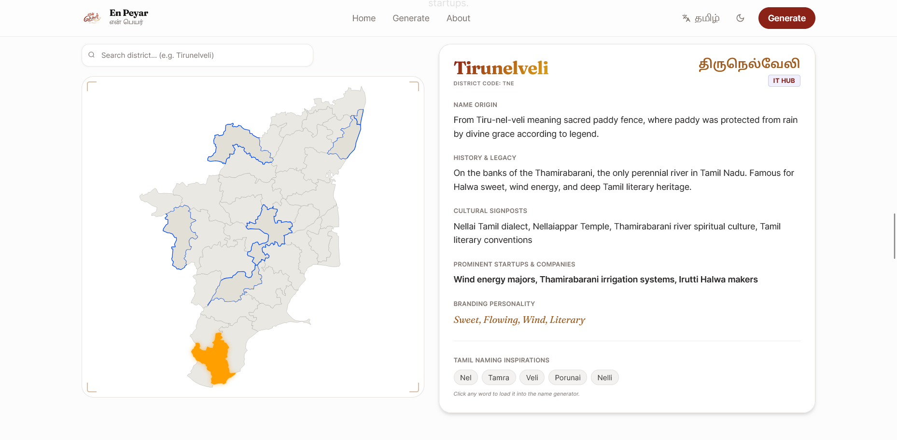

<p align="center">
  
</p>

<h1 align="center">என் பெயர் • En Peyar</h1>

<p align="center">
  AI-powered Tamil naming platform for founders, startups, creators, communities, and ambitious builders.
</p>

<p align="center">
  <strong>From Sangam to Startup.</strong>
</p>

<p align="center">
  Transform Tamil roots, literature, culture, and history into meaningful modern brands.
</p>

<p align="center">
  <a href="https://en-peyar.indevs.in/">
    
  </a>
  <a href="https://github.com/MKishoreDev/en-peyar">
    
  </a>
</p>

<p align="center">
  
  
  
  
  
</p>

<p align="center">
  

---

## Why En Peyar?

Naming is the first act of creation.

Before code is written.

Before customers arrive.

Before investments are raised.

A name becomes identity.

Tamil is one of the world's oldest living languages with more than 2000 years of literary heritage. Every word carries meaning, memory, philosophy, and culture.

En Peyar helps founders discover names inspired by Tamil language, literature, history, and regional heritage while remaining modern, memorable, and globally usable.

Instead of choosing between heritage and reach, En Peyar helps you have both.

---

## Screenshots

<p align="center">
  
</p>

<p align="center">
  
</p>

<p align="center">
  
</p>

---

## Features

### 🤖 AI-Powered Naming

Generate startup-ready names using your idea, keywords, industry, and vision.

### 🌍 Global Tamil Naming

Create modern brand names inspired by Tamil roots while remaining globally pronounceable.

Examples of naming concepts:

- Aram (Virtue)
- Aazhi (Ocean)
- Munai (Frontier)
- Semmai (Excellence)
- Ver (Root)

### 📖 Tamil Root Discovery

Every generated name is connected to its linguistic roots and meaning.

Discover the story behind every word.

### ⚡ PWA (Progressive Web App) Ready

Install En Peyar directly to your home screen or desktop. Works seamlessly as a native-feeling application with offline capabilities and improved performance.

### 🗺️ Tamil Nadu District Explorer

Explore Tamil Nadu through an interactive district map.

Discover:

- Name origins
- Historical significance
- Cultural identity
- Regional branding inspiration
- Notable businesses

Powered by:

https://www.npmjs.com/package/svgmap-tamilnadu

### 📜 Thirukkural Inspiration

Receive timeless wisdom from Thiruvalluvar while exploring names and ideas.

Integrated directly into the platform as a source of inspiration for builders and creators.

### 🎨 Brand Toolkit

Every generated name includes:

- Meaning
- Pronunciation
- Tagline
- Brand Score
- Brand Preview
- Logo Prompt
- Domain Availability Estimate

### 🎯 Multiple Naming Styles

Generate names using:

- Tamil
- Global Tamil
- English
- Contextual Heritage

### 🔓 Open Source

Built openly for the community.

Contributions, improvements, and ideas are always welcome.

---

## Philosophy

Not every Tamil word is a brand.

A great brand name is not chosen because it is ancient.

It is chosen because it is meaningful.

A strong name should:

- Communicate something
- Be easy to remember
- Be easy to pronounce
- Scale globally
- Remain authentic

En Peyar combines:

**Meaning. Sound. Roots. Future.**

to create names that feel timeless rather than trendy.

---

## Inspiration

Projects like **Arattai** demonstrate how native Tamil words can become memorable modern products.

En Peyar explores the same belief:

Local language can power global products.

Tamil words are not relics.

They are building blocks for the future.

---

## Technology Stack

- HTML
- CSS
- JavaScript
- AI-assisted naming workflows
- Tamil linguistic datasets
- SVG district explorer
- Modern frontend architecture

---

## Installation

```bash
git clone https://github.com/MKishoreDev/en-peyar.git

cd en-peyar

npm install

npm run dev
````

---

## Data Sources & Credits

### Thirukkural API

Used for Thirukkural discovery and inspiration.

https://tamil-kural-api.vercel.app

### Tamil Nadu SVG Map

Interactive district explorer powered by:

https://www.npmjs.com/package/svgmap-tamilnadu

### Literary Inspiration

Inspired by:

* Sangam Literature
* Thirukkural
* Classical Tamil Vocabulary
* Tamil Etymology
* Historical Tamil Place Names
* Tamil Cultural Heritage

---

## Acknowledgements

### Stackryze Domains

Special thanks to **Stackryze Domains** for providing the official project subdomain:

**https://en-peyar.indevs.in**

Managed under the **indevs.in** namespace.

Stackryze Domains provides secure, free subdomains for developers, students, startups, and open-source projects.

Their support helps independent builders launch projects without infrastructure barriers.

Project by:

**Stackryze (Registered MSME India)**

Website:
https://stackryze.com

Contact:

* [support@stackryze.com](mailto:support@stackryze.com)
* [contact@stackryze.com](mailto:contact@stackryze.com)
* [legal@stackryze.com](mailto:legal@stackryze.com)
* [security@stackryze.com](mailto:security@stackryze.com)

### Open Source Community

Thanks to every contributor, translator, researcher, maintainer, and builder helping preserve and modernize Tamil knowledge on the internet.

Projects like En Peyar exist because of the open-source community.

---

## Contributing

Contributions are welcome.

You can help by:

* Adding Tamil roots
* Improving translations
* Enhancing prompts
* Expanding district information
* Reporting bugs
* Suggesting new features
* Improving documentation

---

## Built in Tamil Nadu

Tamil Nadu has always been a place where language, trade, creativity, and innovation meet.

From ancient literary academies and maritime trade routes to modern startups and open-source communities, innovation has always had roots here.

En Peyar is proudly built in Tamil Nadu and designed for the world.

---

## License

MIT License.

Fork it.

Build on it.

Improve it.

Share it.

---

<p align="center">
  <strong>Hosted on indevs.in • Powered by Stackryze Domains</strong>
</p>

<p align="center">
  <strong>Every company begins with a name.</strong>
</p>

<p align="center">
  <strong>Every name begins with a story.</strong>
</p>

<p align="center">
  தமிழ் வாழ்க ❤️
</p>
